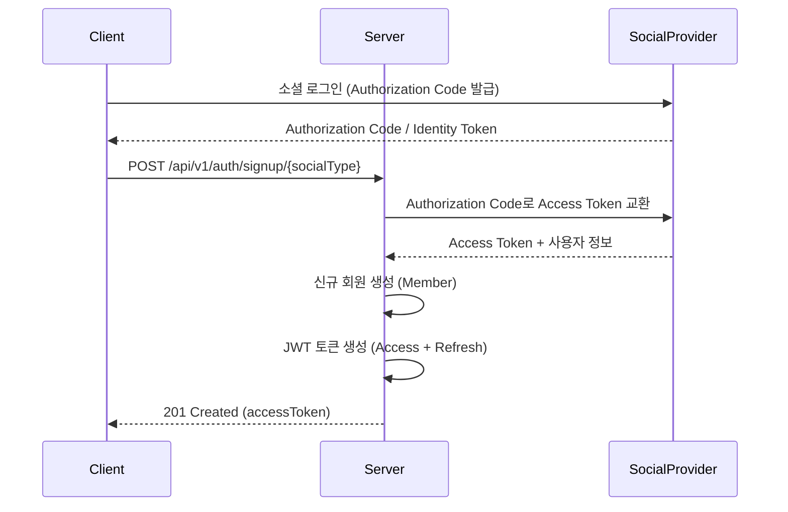
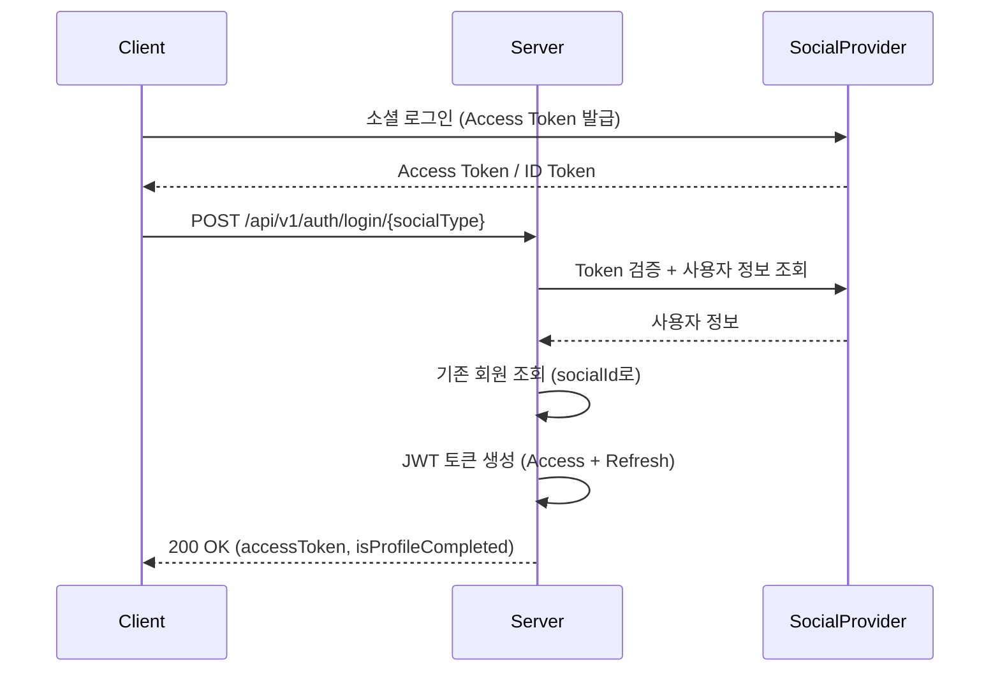
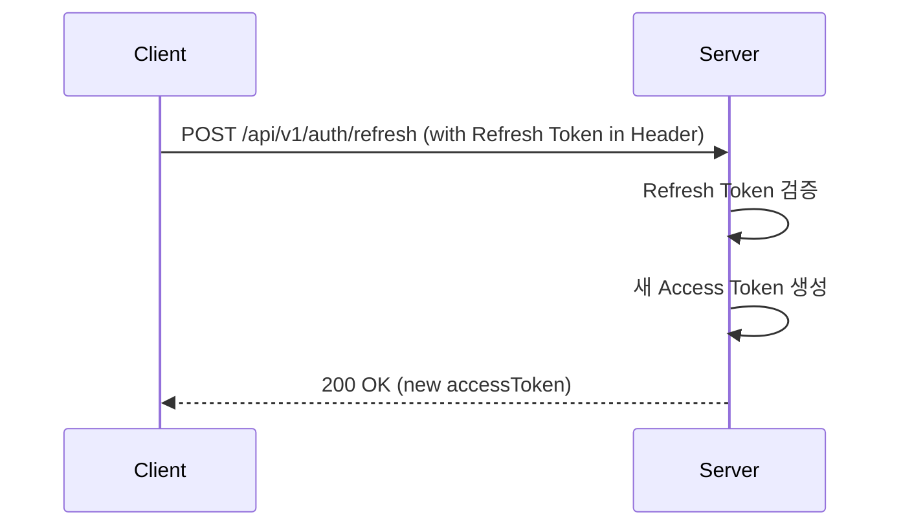
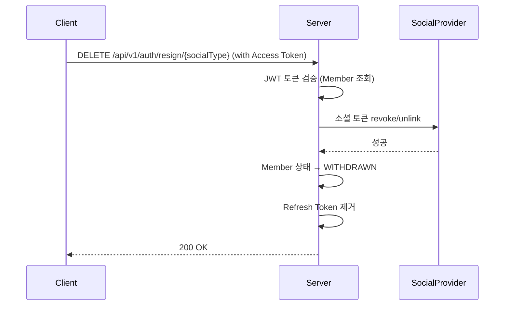

# Focus to Level Up - API 문서

## 목차
- [인증 (Authentication)](#인증-authentication)
  - [회원가입](#회원가입)
  - [로그인](#로그인)
  - [토큰 갱신](#토큰-갱신)
  - [회원 탈퇴](#회원-탈퇴)
- [테스트](#테스트)
- [공통 응답 형식](#공통-응답-형식)
- [에러 코드](#에러-코드)

---

## Base URL

```
Local: http://localhost:8080
Dev: https://dev.api.studio-edge.app
Prod: TBD
```

---

## 공통 응답 형식

### 성공 응답
```json
{
  "message": "ok",
  "data": {
    // 응답 데이터
  }
}
```

### 에러 응답
```json
{
  "message": "에러 메시지"
}
```

---

## 인증 (Authentication)

모든 인증 API는 `/api/v1/auth` 경로를 사용합니다.

### 지원하는 소셜 로그인
- `KAKAO` - 카카오
- `NAVER` - 네이버
- `GOOGLE` - 구글
- `APPLE` - 애플

---

### 회원가입

신규 사용자를 등록합니다.

#### 1. Kakao 회원가입

**Endpoint**
```
POST /api/v1/auth/signup/kakao
```

**Request Body (두 가지 방식 지원)**

1️⃣ **Authorization Code 방식** (웹 애플리케이션)
```json
{
  "authorizationCode": "카카오 인가 코드",
  "fcmToken": "FCM 토큰 (선택사항)"
}
```

2️⃣ **Token 방식** (Flutter SDK 등 클라이언트에서 직접 토큰 발급)
```json
{
  "accessToken": "카카오 Access Token",
  "refreshToken": "카카오 Refresh Token",
  "fcmToken": "FCM 토큰 (선택사항)"
}
```

> **Note**: Flutter Kakao SDK는 클라이언트에서 직접 Access Token과 Refresh Token을 발급받으므로, Token 방식을 사용하세요.

**Response** `201 Created`
```json
{
  "message": "created",
  "data": {
    "accessToken": "eyJhbGciOiJIUzI1NiIsInR5cCI6IkpXVCJ9..."
  }
}
```

**Error Cases**
- `400` - 이미 가입된 회원
- `401` - 유효하지 않은 인가 코드 또는 토큰

---

#### 2. Naver 회원가입

**Endpoint**
```
POST /api/v1/auth/signup/naver
```

**Request Body**
```json
{
  "authorizationCode": "네이버 인가 코드",
  "state": "CSRF 방지용 state 값 (선택사항)",
  "fcmToken": "FCM 토큰 (선택사항)"
}
```

**Response** `201 Created`
```json
{
  "message": "ok",
  "data": {
    "accessToken": "eyJhbGciOiJIUzI1NiIsInR5cCI6IkpXVCJ9..."
  }
}
```

**참고사항**
- `state` 파라미터는 선택사항입니다
- 제공하지 않으면 기본값 "STATE" 사용

---

#### 3. Google 회원가입

**Endpoint**
```
POST /api/v1/auth/signup/google
```

**Request Body**
```json
{
  "authorizationCode": "구글 인가 코드",
  "fcmToken": "FCM 토큰 (선택사항)"
}
```

**Response** `201 Created`
```json
{
  "message": "ok",
  "data": {
    "accessToken": "eyJhbGciOiJIUzI1NiIsInR5cCI6IkpXVCJ9..."
  }
}
```

---

#### 4. Apple 회원가입

**Endpoint**
```
POST /api/v1/auth/signup/apple
```

**Request Body**
```json
{
  "identityToken": "Apple Identity Token",
  "authorizationCode": "Apple Authorization Code",
  "fcmToken": "FCM 토큰 (선택사항)"
}
```

**Response** `201 Created`
```json
{
  "message": "ok",
  "data": {
    "accessToken": "eyJhbGciOiJIUzI1NiIsInR5cCI6IkpXVCJ9..."
  }
}
```

**참고사항**
- Apple은 Identity Token과 Authorization Code 모두 필요

---

### 로그인

기존 사용자가 로그인합니다.

#### 1. Kakao 로그인

**Endpoint**
```
POST /api/v1/auth/login/kakao
```

**Request Body**
```json
{
  "identityToken": "카카오 Access Token (Flutter SDK 등에서 발급받은 토큰)",
  "fcmToken": "FCM 토큰 (선택사항)"
}
```

> **Note**: Kakao 로그인은 클라이언트에서 발급받은 Access Token을 `identityToken` 필드에 전달합니다.

**Response** `200 OK`
```json
{
  "message": "ok",
  "data": {
    "accessToken": "eyJhbGciOiJIUzI1NiIsInR5cCI6IkpXVCJ9...",
    "isProfileCompleted": false
  }
}
```

**Error Cases**
- `404` - 가입되지 않은 사용자 (회원가입 필요)
- `401` - 유효하지 않은 액세스 토큰
- `403` - 탈퇴한 회원 (재가입 필요)

---

#### 2. Naver 로그인

**Endpoint**
```
POST /api/v1/auth/login/naver
```

**Request Body**
```json
{
  "identityToken": "네이버 액세스 토큰",
  "fcmToken": "FCM 토큰 (선택사항)"
}
```

**Response** `200 OK`
```json
{
  "message": "ok",
  "data": {
    "accessToken": "eyJhbGciOiJIUzI1NiIsInR5cCI6IkpXVCJ9...",
    "isProfileCompleted": false
  }
}
```

---

#### 3. Google 로그인

**Endpoint**
```
POST /api/v1/auth/login/google
```

**Request Body**
```json
{
  "identityToken": "구글 ID 토큰",
  "fcmToken": "FCM 토큰 (선택사항)"
}
```

**Response** `200 OK`
```json
{
  "message": "ok",
  "data": {
    "accessToken": "eyJhbGciOiJIUzI1NiIsInR5cCI6IkpXVCJ9...",
    "isProfileCompleted": false
  }
}
```

**참고사항**
- Google은 ID Token을 사용 (Access Token 아님)

---

#### 4. Apple 로그인

**Endpoint**
```
POST /api/v1/auth/login/apple
```

**Request Body**
```json
{
  "identityToken": "Apple Identity Token",
  "fcmToken": "FCM 토큰 (선택사항)"
}
```

**Response** `200 OK`
```json
{
  "message": "ok",
  "data": {
    "accessToken": "eyJhbGciOiJIUzI1NiIsInR5cCI6IkpXVCJ9...",
    "isProfileCompleted": false
  }
}
```

---

### 토큰 갱신

Access Token이 만료되었을 때 Refresh Token으로 새로운 Access Token을 발급받습니다.

**Endpoint**
```
POST /api/v1/auth/refresh
```

**Headers**
```
Authorization: Bearer {refreshToken}
```

**Response** `200 OK`
```json
{
  "message": "ok",
  "data": {
    "accessToken": "eyJhbGciOiJIUzI1NiIsInR5cCI6IkpXVCJ9..."
  }
}
```

**Error Cases**
- `401` - 유효하지 않은 Refresh Token
- `401` - Refresh Token 만료
- `403` - Member ID와 토큰 불일치

**참고사항**
- Refresh Token은 Header의 Authorization에 포함하여 전송
- Request Body 없음

---

### 회원 탈퇴

사용자의 계정을 탈퇴 처리합니다. (실제 삭제는 하지 않고 상태를 WITHDRAWN으로 변경)

#### 1. Kakao 탈퇴

**Endpoint**
```
DELETE /api/v1/auth/resign/kakao
```

**Headers**
```
Authorization: Bearer {accessToken}
```

**Response** `200 OK`
```json
{
  "message": "ok",
  "data": null
}
```

**처리 내용**
- 카카오 연결 끊기 (unlink)
- 회원 상태를 WITHDRAWN으로 변경
- Refresh Token 제거

---

#### 2. Naver 탈퇴

**Endpoint**
```
DELETE /api/v1/auth/resign/naver
```

**Headers**
```
Authorization: Bearer {accessToken}
```

**Response** `200 OK`
```json
{
  "message": "ok",
  "data": null
}
```

**처리 내용**
- 네이버 액세스 토큰 revoke
- 회원 상태를 WITHDRAWN으로 변경
- Refresh Token 제거

---

#### 3. Google 탈퇴

**Endpoint**
```
DELETE /api/v1/auth/resign/google
```

**Headers**
```
Authorization: Bearer {accessToken}
```

**Response** `200 OK`
```json
{
  "message": "ok",
  "data": null
}
```

**처리 내용**
- 구글 액세스 토큰 revoke
- 회원 상태를 WITHDRAWN으로 변경
- Refresh Token 제거

---

#### 4. Apple 탈퇴

**Endpoint**
```
DELETE /api/v1/auth/resign/apple
```

**Headers**
```
Authorization: Bearer {accessToken}
```

**Response** `200 OK`
```json
{
  "message": "ok",
  "data": null
}
```

**처리 내용**
- Apple Refresh Token revoke
- 회원 상태를 WITHDRAWN으로 변경
- Refresh Token 제거

---

## 테스트

### Health Check

서버 상태를 확인합니다.

**Endpoint**
```
GET /test/health
```

**Response** `200 OK`
```json
{
  "message": "ok",
  "data": "Server is running!"
}
```

---

### Swagger UI

Swagger UI로 리다이렉트합니다.

**Endpoint**
```
GET /test/swagger
```

**Response** `302 Found`
```
Location: /swagger-ui/index.html
```

---

## 에러 코드

### 인증 관련 에러

| HTTP Status | Message | 설명 |
|-------------|---------|------|
| 404 | 가입되지 않은 사용자입니다. | 로그인 시도했으나 회원가입 필요 |
| 401 | 유효하지 않은 소셜 로그인 토큰입니다. | 소셜 로그인 Token이 유효하지 않음 |
| 401 | 유효하지 않은 토큰입니다. | JWT 토큰 검증 실패 |
| 403 | 토큰과 회원 정보가 일치하지 않습니다. | Refresh Token과 Member ID 불일치 |
| 401 | Refresh Token이 만료되었습니다. | 재로그인 필요 |

### 일반 에러

| HTTP Status | Message | 설명 |
|-------------|---------|------|
| 400 | 잘못된 요청입니다. | 요청 파라미터 오류 |
| 401 | 인증이 필요합니다. | 로그인 필요 |
| 403 | 접근 권한이 없습니다. | 권한 부족 |
| 404 | 리소스를 찾을 수 없습니다. | 존재하지 않는 리소스 |
| 500 | 서버 내부 오류입니다. | 서버 오류 |

---

## 인증 Flow

### 1. 신규 사용자 가입 Flow



### 2. 기존 사용자 로그인 Flow



### 3. Access Token 갱신 Flow



### 4. 회원 탈퇴 Flow



---

## JWT Token 정보

### Access Token
- **유효기간**: 2시간
- **용도**: API 인증
- **Header**: `Authorization: Bearer {accessToken}`
- **반환**: 회원가입, 로그인, 토큰 갱신 시 반환

### Refresh Token
- **유효기간**: 2주
- **용도**: Access Token 갱신
- **저장**: 서버 DB에 저장 (클라이언트는 받지 않음)
- **사용**: 토큰 갱신 API 호출 시 Header로 전송

### Token Payload
```json
{
  "memberId": 1,
  "type": "ACCESS" // or "REFRESH"
}
```

---

## 참고사항

### 1. 소셜 로그인별 필요한 값

| 소셜 | 회원가입 Request | 로그인 Request |
|------|---------|--------|
| Kakao | authorizationCode | identityToken (Kakao Access Token) |
| Naver | authorizationCode, state (optional) | identityToken (Naver Access Token) |
| Google | authorizationCode | identityToken (Google ID Token) |
| Apple | identityToken, authorizationCode | identityToken |

**참고**:
- 모든 Request DTO는 범용 DTO를 사용하며, 각 플랫폼에 필요한 필드만 채워서 전송
- `identityToken` 필드는 각 플랫폼의 토큰을 담는 범용 필드명

### 2. 탈퇴 후 재가입

- 탈퇴한 회원(WITHDRAWN)이 다시 로그인 시도하면 `403 Forbidden` 에러 발생
- 재가입 필요: `/api/v1/auth/signup/{socialType}` 호출
- 재가입 시 기존 회원 정보 재활성화 (상태 WITHDRAWN → ACTIVE)

### 3. 인증이 필요한 API

- `/api/v1/auth/**` 외의 모든 엔드포인트는 JWT Access Token 필요
- Header에 `Authorization: Bearer {accessToken}` 포함 필수

### 4. Swagger UI

- URL: `http://localhost:8080/swagger-ui/index.html`
- Bearer Token 인증 지원
- 우측 상단 "Authorize" 버튼으로 토큰 등록 후 테스트 가능

---

## Contact

- **Project**: Focus to Level Up
- **Tech Stack**: Spring Boot 3.3.5, Java 17, MySQL 8.0
- **Swagger**: http://localhost:8080/swagger-ui/index.html
